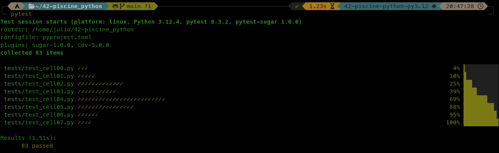

# :snake: 42 Firenze - Discovery Piscine Python (2024)

### :dart: Objetivo / Obiettivo
:brazil: A Discovery Piscine Python tem como objetivo principal ensinar o básico da linguagem Python no estilo 42.
Como objetivo secundário, achei interessante adicionar o framework de testes [PyTest](https://pytest.org).

:it: Lo scopo principale di Discovery Piscine Python è quello di insegnare le basi del linguaggio Python in stile 42.
Come obiettivo secondario, ho pensato che sarebbe stato interessante aggiungere il framework per i test [PyTest](https://pytest.org).


### :wrench: Configuração / Configurazione
:brazil: Para instalar o PyTest, é interessante que faça com um gerenciador de pacotes.
Deixei pré-configurado o `pyproject.toml` com [PDM](https://pdm-project.org) e [Poetry](https://python-poetry.org/)

Caso não tenha instalado na máquina, recomendo escolher um deles e verificar a melhor forma de instala-los.

Depois de ter instalado o PDM ou Poetry (ou ambos), basta fazer o clone do repositório:

:it: Per installare PyTest, è bene utilizzare un gestore di pacchetti.
L'ho lasciato preconfigurato `pyproject.toml` con [PDM](https://pdm-project.org) e [Poetry](https://python-poetry.org/)

Se non è installato sul vostro computer, vi consiglio di sceglierne uno e di verificare il modo migliore per installarlo.

Una volta installato PDM o Poetry (o entrambi), è sufficiente clonare il repository:
```bash
git clone https://github.com/julioformiga/42-piscine-python
cd 42-piscine-python
```
---
###### PDM
```
pdm install
eval $(pdm venv activate)
```
OU/O
###### Poetry
```
poetry shell
poetry install
```
---

### :white_check_mark: PyTest
:brazil: As pastas da Piscine devem estar na pasta `./src/`, substituindo as que já estão.

:it: Le cartelle di Piscine devono trovarsi nella cartella `./src/`, sostituendo quelle esistenti.

```bash
.
├── src
│   ├── cell00
│   ├── cell01
│   ├── cell02
│   ├── cell03
│   ├── cell04
│   ├── cell05
│   ├── cell06
│   └── cell07
...
```


```bash
pytest
```


### :construction: WIP

:brazil: Sendo um projeto de estudo pessoal, dificilmente os testes escritos servirão para outras soluções, mas a ideia de compartilhar é ser apenas um ponto de partida para que outras pessoas adequem os testes as soluções (ou vice-versa), além de estar aberto a correções e melhorias.

:it: Trattandosi di un progetto di studio personale, è improbabile che i test scritti vengano utilizzati per altre soluzioni, ma l'idea di condivisione vuole essere solo un punto di partenza per altre persone per adattare i test alle soluzioni (o viceversa), oltre a essere aperta a correzioni e miglioramenti.
